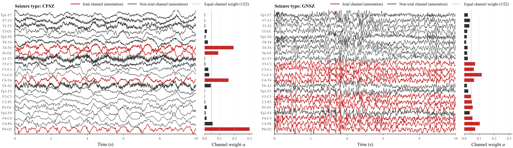

# S4-iTNet

[中文说明](README_zh-CN.md)

Detection-guided channel aggregation for seizure type classification from EEG.

## Installation

Python 3.9, PyTorch 2.1.2, and CUDA 11.8. Linux is recommended for GPU training with PyKeOps; a C++ compiler and CUDA development toolkit are required.

```bash
conda create -n s4_itnet python=3.9
conda activate s4_itnet
pip install torch==2.1.2 --index-url https://download.pytorch.org/whl/cu118
pip install -r requirements-cuda.txt
```

## Data Preparation

Download [TUSZ v2.0.6](https://isip.piconepress.com/projects/tuh_eeg/html/downloads.shtml) under its access terms. Patient EEG data is not included in this repository.

Place EDF recordings and their annotations under `edf/{train,dev,eval}/<patient>/...`, then run:

```bash
python -m preprocessing.build_dataset \
  --input-root /path/to/tusz_v2.0.6 \
  --output-dir /path/to/processed_10s \
  --assignment-csv preprocessing/patient_split.csv \
  --duration-sec 10 --workers 1 \
  --overlap-ratio 0.40 --gnsz-stride-sec 6 \
  --absz-stride-sec 0.2 --ctsz-stride-sec 2
python data_audit.py --data-root /path/to/processed_10s
```

The final experiments use a fixed patient-wise split defined by `preprocessing/patient_split.csv`. The official `train`/`dev`/`eval` directory names are used only to locate source recordings; they are not retained as the final experimental split.

Each split (`train`, `val`, `test`) contains:

| File | Contents |
|---|---|
| `<split>.npy` | EEG windows, shape (N, 22, 2000) |
| `<split>_multi_label.npy` | Class labels, shape (N,) |
| `<split>_bi_label.npy` | Channel labels, shape (N, 22) |

The builder also writes `window_manifest_array_order.csv`.
Class labels: `0=CFSZ`, `1=GNSZ`, `2=ABSZ`, `3=CTSZ`.
See [data format](docs/DATA.md) for details.

The assignment CSV includes patients assigned before window retention (196/22/18 for train/validation/test). These are not retained-sample counts. In the main 10-second run, eligible training events involve 169 patients and 1,413 events; retained windows involve 167 patients and 1,401 events. Some events contribute no valid windows. The final validation/test windows involve 21/16 patients. Per-epoch training sampling targets are 8,000/4,000/800/800 for CFSZ/GNSZ/ABSZ/CTSZ.

## Training

```bash
python train.py \
  --data-root /path/to/processed_10s \
  --output runs/s4_itnet \
  --device cuda:0
```

Settings are in [configs/s4_itnet_10s.json](configs/s4_itnet_10s.json). Use `--config` to provide a custom configuration and a new output directory for each run.


## Detection checkpoint selection

The two-stage `train.py` run saves Stage 1 checkpoints selected by validation channel F1, channel accuracy, and detection loss in `model/stage1_selection_checkpoints/`. It saves Stage 2 checkpoints selected by validation classification metrics in `model/selection_checkpoints/`. Each directory also contains `selection.json` and validation confusion matrices. The transition to Stage 2 uses validation detection-loss patience.

Evaluate the channel-F1-selected Stage 1 checkpoint from the same two-stage run:

```bash
python evaluate.py --data-root /path/to/processed_10s \
  --checkpoint runs/s4_itnet/model/stage1_selection_checkpoints/best_by_channel_f1.pth \
  --detection-only --device cuda:0 --output outputs/stage1_detection
```

Detection metrics pool all window-channel pairs and classify a channel as positive when its sigmoid probability is greater than 0.5. Normal evaluation also reports these metrics alongside seizure type classification metrics.

The reported Stage 1 test channel accuracy of 0.738516 and channel F1 of 0.776546 (epoch 2; validation channel F1 0.711083), and the Stage 2 test channel F1 of 0.6938, are evaluations of checkpoints selected at different stages of the same two-stage run. The Stage 2 checkpoint is selected by validation weighted F1. Only the Stage 2 weighted-F1-selected weights are included in this repository; running `train.py` creates both stage-specific checkpoints.

## Evaluation

```bash
python evaluate.py \
  --data-root /path/to/processed_10s \
  --checkpoint runs/s4_itnet/model/selection_checkpoints/best_by_weighted_f1.pth \
  --device cuda:0 \
  --output outputs/evaluation
```

To use the provided weights, set `--checkpoint checkpoints/s4_itnet_10s_wf1.pth`.
The script saves classification metrics, a confusion matrix, predictions, and channel weights.

## Visualization

Plot the EEG traces and channel weights for a test window:

```bash
python visualize.py \
  --data-root /path/to/processed_10s \
  --checkpoint checkpoints/s4_itnet_10s_wf1.pth \
  --index 0 --device cuda:0 \
  --output outputs/channel_weights.png
```

An example visualization is shown below. Red traces and bars denote channels annotated as ictal, black traces and bars denote non-ictal channels, and the dashed line marks equal channel weight (`1/22`). The example contains two seizure types, CFSZ and GNSZ. The data included in this repository are synthetic fixtures for testing and cannot reproduce these two real-data visualizations. The figure was generated from TUSZ v2.0.6 recordings, which cannot be redistributed by the authors because of the dataset's access and usage terms. To generate equivalent figures, obtain TUSZ v2.0.6 under its official terms and follow the data-preparation and visualization instructions above.

The two panels correspond to the following test-set samples:

| Panel | Class | Test-set array index | Patient ID | Source recording | Annotated event interval | 10-s window | Ictal channels |
| --- | --- | ---: | --- | --- | --- | --- | ---: |
| Left | CFSZ | 49 | `aaaaarpv` | `aaaaarpv_s001_t003.edf` | 126.9927--214.8366 s | 190.9927--200.9927 s | 4/22 |
| Right | GNSZ | 577 | `aaaaatdt` | `aaaaatdt_s001_t001.edf` | 1.0000--1162.9329 s | 580.0000--590.0000 s | 10/22 |



## Smoke Test

The included samples are synthetic and can be used to check the setup on CPU.

```bash
python smoke_test.py --device cpu
python train.py --data-root dataset/smoke_demo --output outputs/train_smoke --device cpu --smoke
python -m pytest -q
```

## Acknowledgments

This project uses components from [S4](https://github.com/state-spaces/s4) and [iTransformer](https://github.com/thuml/iTransformer).
Code is released under [Apache-2.0](LICENSE); see [third-party notices](THIRD_PARTY_NOTICES.md) for upstream licenses.
